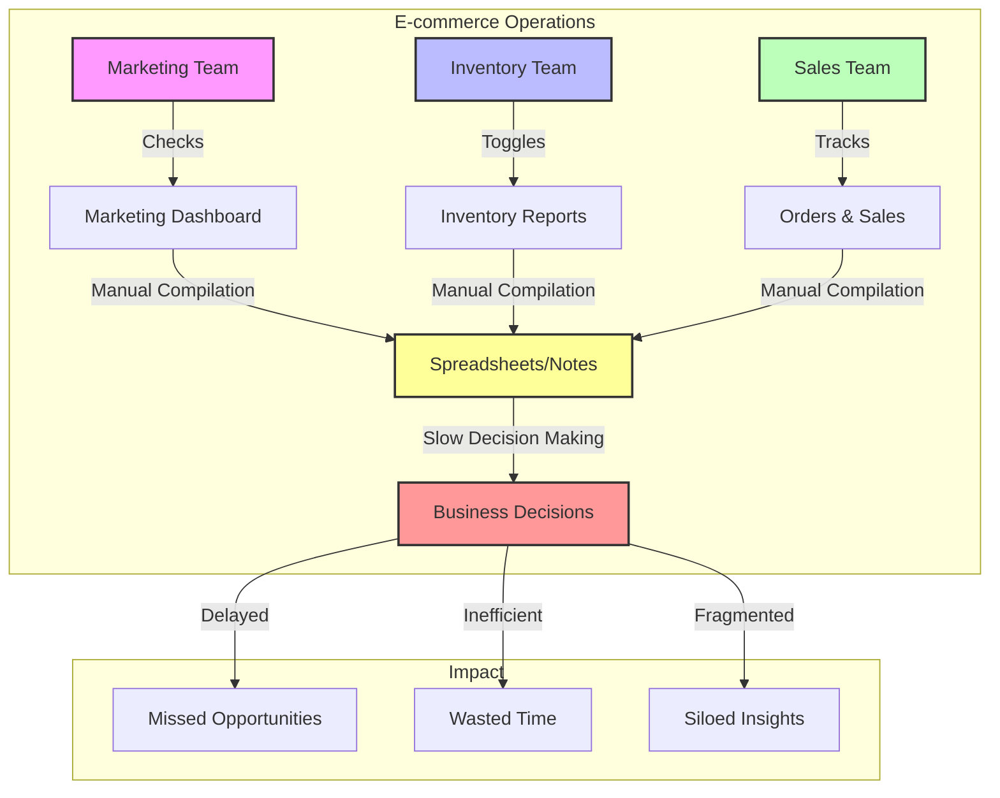

```mermaid
graph TD
    subgraph "E-commerce Operations"
        Marketing[Marketing Team]
        Inventory[Inventory Team]
        Sales[Sales Team]
        
        Marketing -->|Checks| MarketingDash[Marketing Dashboard]
        Inventory -->|Toggles| InventoryRep[Inventory Reports]
        Sales -->|Tracks| OrderSales[Orders & Sales]
        
        MarketingDash -->|Manual Compilation| Spreadsheet[Spreadsheets/Notes]
        InventoryRep -->|Manual Compilation| Spreadsheet
        OrderSales -->|Manual Compilation| Spreadsheet
        
        Spreadsheet -->|Slow Decision Making| Decision[Business Decisions]
        
        style Marketing fill:#f9f,stroke:#333,stroke-width:2px
        style Inventory fill:#bbf,stroke:#333,stroke-width:2px
        style Sales fill:#bfb,stroke:#333,stroke-width:2px
        style Spreadsheet fill:#ff9,stroke:#333,stroke-width:2px
        style Decision fill:#f99,stroke:#333,stroke-width:2px
    end

    subgraph "Impact"
        Decision -->|Delayed| Opportunities[Missed Opportunities]
        Decision -->|Inefficient| Time[Wasted Time]
        Decision -->|Fragmented| Insights[Siloed Insights]
    end
``` 