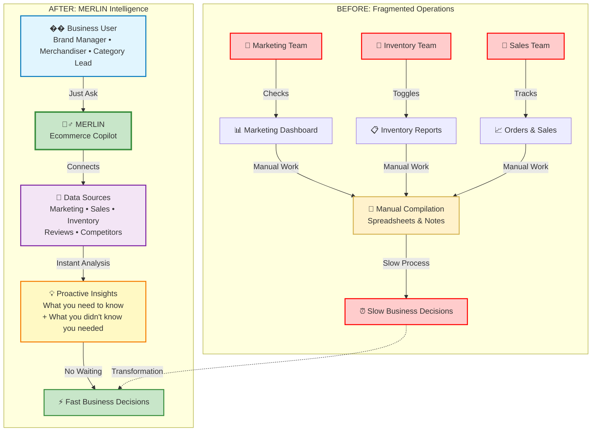

# MERLIN Solution Overview

## Before vs After: MERLIN Transformation

## Key Transformation Points

- **From**: Multiple disconnected systems → **To**: Single intelligent interface
- **From**: Manual compilation work → **To**: Automated analysis  
- **From**: Waiting on reports → **To**: Instant insights
- **From**: Siloed insights → **To**: Connected intelligence
- **From**: Reactive decisions → **To**: Proactive recommendations 