# MERLIN Solution Overview

## Before vs After: MERLIN Transformation

```mermaid
graph TB
    subgraph "BEFORE: Fragmented Operations"
        direction TB
        Marketing[👥 Marketing Team]
        Inventory[👥 Inventory Team] 
        Sales[👥 Sales Team]
        
        Marketing -->|Checks| MarketingDash[📊 Marketing Dashboard]
        Inventory -->|Toggles| InventoryRep[📋 Inventory Reports]
        Sales -->|Tracks| OrderSales[📈 Orders & Sales]
        
        MarketingDash -->|Manual Work| Manual[📝 Manual Compilation<br/>Spreadsheets & Notes]
        InventoryRep -->|Manual Work| Manual
        OrderSales -->|Manual Work| Manual
        
        Manual -->|Slow Process| SlowDecision[⏰ Slow Business Decisions]
        
        style Marketing fill:#ffcccc,stroke:#ff0000,stroke-width:2px
        style Inventory fill:#ffcccc,stroke:#ff0000,stroke-width:2px
        style Sales fill:#ffcccc,stroke:#ff0000,stroke-width:2px
        style Manual fill:#fff2cc,stroke:#d6b656,stroke-width:2px
        style SlowDecision fill:#ffcccc,stroke:#ff0000,stroke-width:2px
    end
    
    subgraph "AFTER: MERLIN Intelligence"
        direction TB
        User[�� Business User<br/>Brand Manager • Merchandiser • Category Lead]
        
        User -->|Just Ask| MERLIN[🧙‍♂️ MERLIN<br/>Ecommerce Copilot]
        
        MERLIN -->|Connects| AllData[🔗 Data Sources<br/>Marketing • Sales • Inventory<br/>Reviews • Competitors]
        
        AllData -->|Instant Analysis| Insights[💡 Proactive Insights<br/>What you need to know<br/>+ What you didn't know you needed]
        
        Insights -->|No Waiting| FastDecision[⚡ Fast Business Decisions]
        
        style User fill:#e1f5fe,stroke:#0277bd,stroke-width:2px
        style MERLIN fill:#c8e6c9,stroke:#388e3c,stroke-width:3px
        style AllData fill:#f3e5f5,stroke:#7b1fa2,stroke-width:2px
        style Insights fill:#fff9c4,stroke:#f57c00,stroke-width:2px
        style FastDecision fill:#c8e6c9,stroke:#388e3c,stroke-width:2px
    end
    
    SlowDecision -.->|Transformation| FastDecision
```

## Key Transformation Points

- **From**: Multiple disconnected systems → **To**: Single intelligent interface
- **From**: Manual compilation work → **To**: Automated analysis  
- **From**: Waiting on reports → **To**: Instant insights
- **From**: Siloed insights → **To**: Connected intelligence
- **From**: Reactive decisions → **To**: Proactive recommendations 